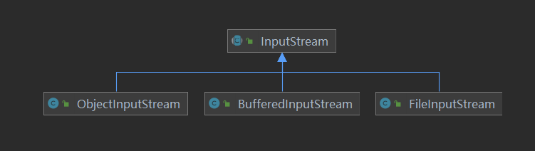
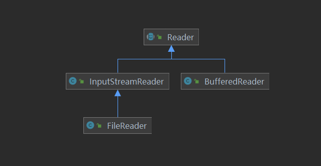

# IO流

#### 文件

* 概念

  **什么是文件？**

  文件是保存数据的地方 比如我们经常使用的word文档 txt文件 excel文件...都是文件。它既可以保存一张图片 也可以保存视频 音频等等。

  **文件流**

  文件在程序中是以流的形式来操作的

  Java程序(内存) ------输**出**流------> 文件(磁盘)

  Java程序(内存) <----输**入**流-------- 文件(磁盘)

* 常用操作

  **创建文件**

  常用构造方法:

  ```java
  new File(Stirng pathName);//更具路径构建一个File对象
  new File(File parent,String child);//根据目录文件——子路径构建
  new File(String parent,String child);//根据父目录+子目录构建
  ```

  **获取文件的相关信息**

  getName	获取名称

  getAbsolutePath	绝对路径

  getParent	父级目录

  length	文件大小

  exists	是否存在

  isFile	是否为文件

  isDirectory	是否为文件夹

  **目录操作**

  mkdir	创建一级目录

  mkdirs	创建多级目录

  delete	删除空目录或者文件

  

#### 什么是IO？

* I/O是Input/Output的缩写，I/O技术是非常实用的技术，用于处理数据传输 如读/写文件 网路通讯等。
* Java程序中，对与数据的输入/输出操作以”流(Stream)“的方式进行。
* java.io包下提供了各种"流"类和接口，用于获取不同种类的数据，并同各种方法输入或者输出数据。

#### 流的分类

* 按操作数据单位不同分为: 字节流(8 bit) 字符流(按字符)
* 按数据流的流向不同分为: 输入流 输出流
* 按流的角色的不同分为: 节点流 处理流/包装流

| 抽象基类 | 字节流       | 字符流 |
| -------- | ------------ | ------ |
| 输入流   | InputStream  | Reader |
| 输出流   | OutputStream | Writer |

* Java的IO流共涉及40多个类 实际上非常规则 都是从如上4个抽象基类派生的
* 由这四个类派生出来的子类名车都是以其父类名作为子类名的后缀

#### 节点流和处理流

**节点流和处理流的区别和联系**

* 节点流是底层流/低级流，直接跟数据源相接
* 处理流包装节点流，既可以用消除不同节点流的实现差异，也可以提供更翻遍的方法来完成输入输出
* 处理流(包装流)对节点流进行包装，使用了装饰器设计模式，不会直接与数据源相连

**处理流的功能主要体现在以下两个方面**

* 性能更高：主要以增加缓冲的方式来提供输入输出的效率
* 操作的便捷：处理流可能提供了一系列便捷的方法来一次输入输出大批量的数据，使用更加灵活方便


#### 序列化和反序列化

* 序列化就是在保存数据时，保存数据的值和数据类型
* 反序列化就是在回复数据时，恢复数据的值和数据类型
* 需要让某个对象支持序列化机制，则必须让其类是可序列化的，为了让某个类是可序列化的必须实现如下两个接口之一：
  * Serializeable
  * Externalizable


#### 输入流(InputStream Reader)

读取外部数据(磁盘/光盘等储存设备的数据)到程序(内存中)

* InputStream

  

  * FileInputStream

    **常用构造**

    ```java
    public FileInputStream(String name);// 文件路径
    public FileInputStream(File file);// 文件对象
    ```

    **常用方法**

    ```java
    int read();// 读取一个字节 返回结果如果为-1则表示读取完毕
    int read(byte b[]);// 读取多个字节并将读取到的数据写入到传入的字节数组内 返回结果为-1表示读取完毕否则为实际读取到的字节数
    int read(byte b[], int off, int len);
    
    void close(); //关闭流
    ```

    

  * BufferedInputStream

  * ObjectInputStream

* Reader

  

  * FileReader

    **常用构造**

    ```java
    new FileReader(String fileName);// 文件路径
    new FileReader(File file);// 文件对象
    ```

    

    **常用方法**

    ```java
    public int read();// 每次读取单个字符，返回该字符，如果到文件末尾返回-1
    public int read(char cbuf[]);// 批量读取多个字符到数组，返回读取到的字符数，如果到文件末尾返回-1
    ```

    

  * BufferedReader

    **常用构造**

    ```java
    public BufferedReader(Reader in)
    ```

    **常用方法**

    ```java
    public String readLine();// 单行读取 如果返回结果为null时，则文件读取完毕
    
    public void close();// 关闭流(内部节点流会自动关闭)
    ```

  * InputStreamReader

#### 输出流(Outputstream Wtiter)

将程序(内存)数据输出到磁盘或者光盘等储存设备中

* OutputStream

  

  * FileOutputStream

    **常用构造**

    ```java
    public FileOutputStream(String name);// 文件路径
    public FileOutputStream(String name,boolean append);// 文件路径 为true追加内容
    public FileOutputStream(File file);// 文件对象
    public FileOutputStream(File file,boolean append);// 文件对象 是否追加
    ```

    **常用方法**

    ```java
    void write(int b);// 写出的字节
    void write(byte b[]);// 写出的字节数组
    void write(byte b[], int off, int len);// 字节数组,开始索引,结束索引
    
    void close(); //关闭流
    ```

    

  * BufferedOutputStream

  * ObjectOutputStream

* Writer

  

  * FileWriter

    **常用构造**

    ```java
    new FileWriter(String fileName);
    new FileWriter(File file，true);// true表示是否为追加模式
    ```

    **常用方法**

    ```java
    public void write(int c);// 写入单个字符
    public void write(char cbuf[]);// 写入字符数组
    public void write(char cbuf[], int off, int len);// 写入字符数组并指定范围
    public void write(String str);// 写入字符串
    public void write(String str, int off, int len);// 写入字符串并指定长度
    
    public void flush();// 刷新(写入文件)
    ```

    

  * BufferedWriter

    **常用构造**

    ```java
    public BufferedWriter(Writer out)
    ```

    **常用方法**

    ```java
    public void write(int c);// 写入单个字符
    public void write(char cbuf[]);// 写入字符数组
    public void write(char cbuf[], int off, int len);// 写入字符数组并指定范围
    public void write(String str);// 写入字符串
    public void write(String str, int off, int len);// 写入字符串并指定长度
    
    public void close();// 关闭流(内部节点流会自动关闭)
    ```

    

  * OutputStreamWriter

### Properties

