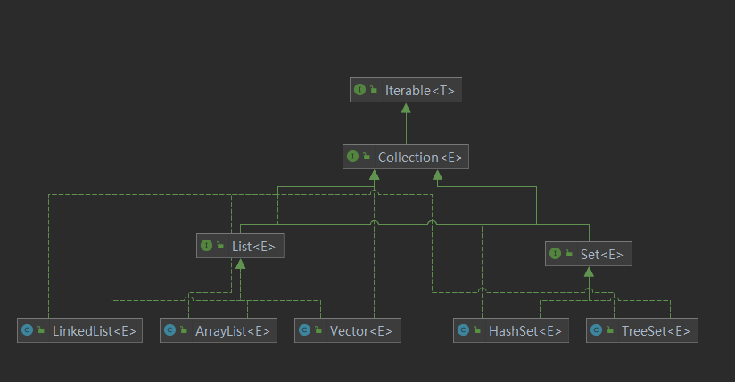
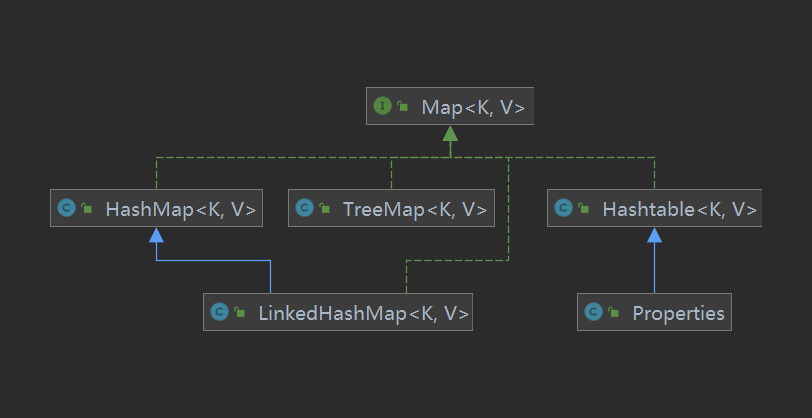
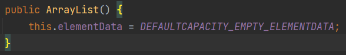
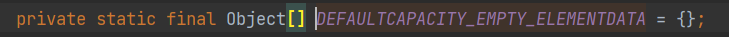
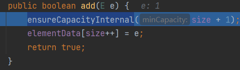

### 集合的好处
以前我们保存多个数据使用的是数组，那么数据有不足的地方

**数组**
+ 长度开始时必须指定，而且一旦指定，不能修改
+ 保存的必须为统一类型的元素
+ 使用数组进行增加元素的示意代码比较麻烦

例如:
```java
Person[] pers = new Person[1];
pers[0] = new Person("小毕",19);
pers[1] = new Person("小黄",19);
```

**集合**
+ 可以动态保存任意多个对象 使用比较方便
+ 提供了一系列方便的操作对象的方法: add remove set get 等
+ 使用集合添加 删除新元素的示意代码简洁了

集合主要分为单列集合 双列集合
### List体系图
List Set它们的实现之类都是单列集合


### Map体系图
Map的实现子类都是双列集合 K-V



### Collection接口实现类的特点
* 有些实现类可以存放重复的元素 有些不可以
* 有些实现类是有序的(List) 有些不是有序的(Set)
* Collection接口没有直接的实现子类，是同各国它的子接口Set和List来实现的

**常用方法**
* add 添加单个元素
* remove 删除指定元素
* contains 查找元素是否存在
* size 获取元素个数
* isEmpty 判断是否为空
* clear 清空
* addAll 添加多个元素
* containsAll 查找多个元素是否都存在
* removeAll 删除多个元素

### Collection接口遍历元素方式
* Iterator对象称为迭代器，主要用于比哪里Collection集合中的元素
* 所有实现了Collection接口的集合类都有一个iterator()方法，用以返回一个实现了Iterator接口的对象，即可以返回一个迭代器。
* Iterator仅用于遍历集合，本身并不存放对象

### 迭代器执行原理
```java
Iterator it = col.iterator();
while(it.hasNext()){// 判断是否有下一个元素
    sout(next());//输出当前元素
}
```

### List接口基本介绍
* List集合类中元素有序(即添加顺序和取出顺序一致) 且可重复
* List集合中的每个元素都有其对应的顺序索引 即支持索引
* List集合中的元素都对应一个整数型的序号记载在其容器中的位置 可以根据存取容器中的元素
* 常用的实现类有 ArrayList LinkedList和Vector

### List接口常用方法
* void add(int index,Object ele) 在index位置插入ele元素
* boolean add(int index,Object eles) 从index位置开始将eles中的所有元素添加进来
* Object get(int index) 获取指定index位置的元素
* int indexOf(Object obj) 返回obj在集合中首次出现的位置
* int lastIndexOf(Object obj) 返回obj在当前集合中最后一次出现的位置
* Object remove(int index) 移除指定index位置的元素 并返回此元素
* Object set(int index,Object ele) 设置指定index位置的元素为ele 相当于是替换
* List subList(int fromIndex,int toIndex) 返回从fromIndex到toIndex位置的子集合

### ArrayList注意事项
* 可以添加多个null
* 是由数组实现数据存储的
* 基本等同于Vector 除了ArrayList是线程不安全的(执行效率高) 在多线程的情况下 不建议使用ArrayList


### ArrayList底层结构和源码分析
* ArrayList中维护了一个Object类型的数组 transient Object[] elementData //transient表示瞬间 短暂的 表示该属性不会被序列化
* 当创建ArrayList对象时，如果使用的是无参构造器，则初始化elementData容量为0，第1此添加，则库欧容elementData为10，如需要再次扩容，则扩容elementData为1.5倍
* 如果使用的是指定大小的构造器，则初始elementData容量为指定的大小，如果需要扩容，则直接扩容elementData为1.5倍

#### 使用无参构造器从创建ArrayList

默认将elementData赋值为一个空的数组



add方法源码

ensureCapacityInternal方法用来检查elementData容量是否足够 不够则进行扩容
然后将元素添加到数组内


```java
private void ensureCapacityInternal(int minCapacity) {// minCapactiy = size + 1
        ensureExplicitCapacity(calculateCapacity(elementData, minCapacity));
}
```

```java
// 默认容量
private static final int DEFAULT_CAPACITY = 10;


private static int calculateCapacity(Object[] elementData, int minCapacity) {
    // 判断elementData是否为空数组
    if (elementData == DEFAULTCAPACITY_EMPTY_ELEMENTDATA) {
        // 为空数组就返回10 第一次扩容为10
        return Math.max(DEFAULT_CAPACITY, minCapacity);
    }
    // size + 1
    return minCapacity;
}
```

```java
private void ensureExplicitCapacity(int minCapacity) {// minCapticy = calculateCapacity方法的返回值
    // 记录当前集合被修改的次数
	modCount++;

    // overflow-conscious code
    // 如果minCapacity大于数组的长度表示需要进行扩容
	if (minCapacity - elementData.length > 0)
        // 扩容具体实现
    	grow(minCapacity);
}
```

```java
private static final int MAX_ARRAY_SIZE = Integer.MAX_VALUE - 8;

// 扩容具体实现
private void grow(int minCapacity) {
    // overflow-conscious code
    // 数组的长度
    int oldCapacity = elementData.length;
    // oldCapacity + (oldCapacity >> 1 = oldCapacity / 2)  扩容1.5倍
    int newCapacity = oldCapacity + (oldCapacity >> 1);
    if (newCapacity - minCapacity < 0)
        // 如果newCapacity比minCapacity小 就将minCapacity赋值给newCapacity
        newCapacity = minCapacity;
    if (newCapacity - MAX_ARRAY_SIZE > 0)
        // 如果新的容量比MAX_ARRAY_SIZE还要大
        newCapacity = hugeCapacity(minCapacity);
    // minCapacity is usually close to size, so this is a win
    // 直接使用Arrays工具类进行数组的拷贝进行扩容
    elementData = Arrays.copyOf(elementData, newCapacity);
}
```

第一次newCapacity = 10 第二次及以后 按照1.5倍进行扩容

#### 使用有参构造创建ArrayList

```java
ArrayList list = new ArrayList(8);

// 有参构造创建ArrayList
public ArrayList(int initialCapacity) {
    // 判断参数是否大于0
    if (initialCapacity > 0) {
        // 直接对数组进行初始化
        this.elementData = new Object[initialCapacity];
    } else if (initialCapacity == 0) {
        // 参数为0直接对数组赋值为空
        this.elementData = EMPTY_ELEMENTDATA;
    } else {
        // 抛出异常
        throw new IllegalArgumentException("Illegal Capacity: "+
                                           initialCapacity);
    }
}
```